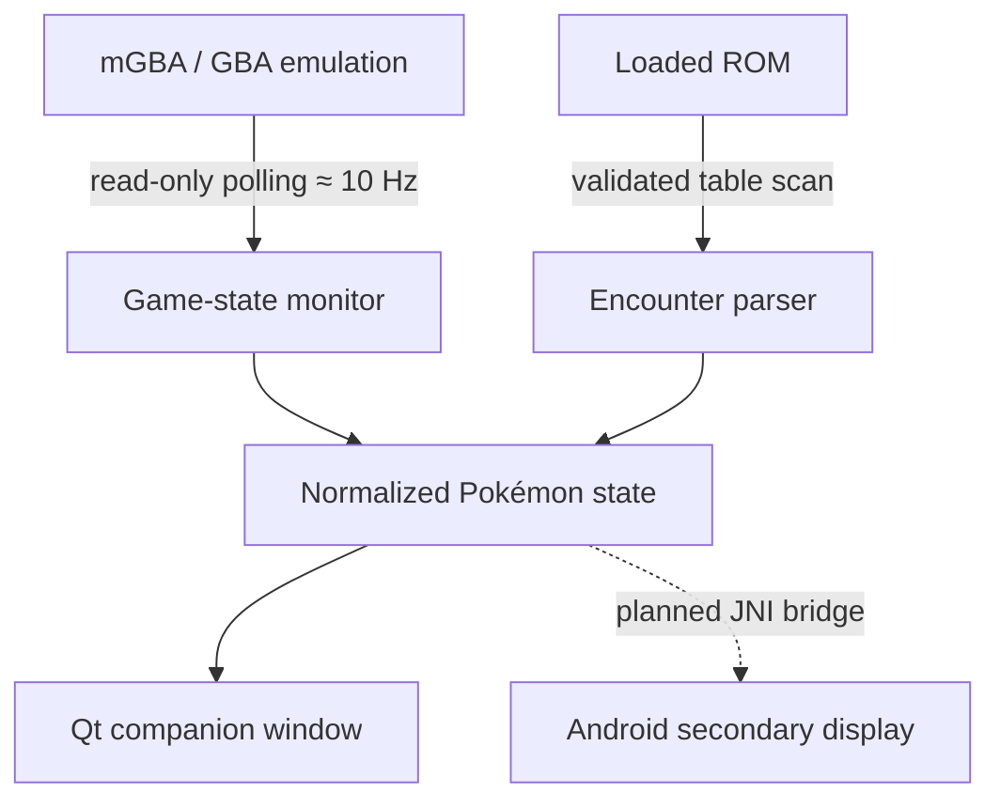

# mGBA Dual-Screen Pokémon Companion

> **Status:** Functional prototype / 開発中プロトタイプ
>
> **Development disclosure:** This is an **AI-assisted project**. The concept, requirements, product decisions, target-device design, testing, and acceptance decisions are mine. AI tools assisted with codebase investigation, implementation, debugging, build configuration, and documentation. See [AI_ASSISTED_DEVELOPMENT.md](AI_ASSISTED_DEVELOPMENT.md).

## 日本語

### 概要

mGBAをベースに、デュアルスクリーンAndroid端末「AYN Thor」での使用を想定して開発している、ポケモンNuzlockeプレイ向けコンパニオン機能のプロトタイプです。

上画面では通常どおりゲームを実行し、下画面には現在地に応じた補助情報を自動表示することを目標としています。プレイヤーがルートを手動選択するのではなく、エミュレーター内部の状態を読み取り、現在のマップとROM内のエンカウントデータを対応付けます。

現在はLinuxデスクトップ版の縦断的プロトタイプが動作しており、ゲーム進行中のRAMから現在地を読み取り、読み込まれたROMから野生ポケモンの情報を解析して別ウィンドウに表示します。Android版はデュアルディスプレイ用の表示シェルまで実装済みですが、mGBAコアとのJNI接続および実機AYN Thorでの検証は未完了です。

### 目標とした体験

- 上画面：mGBAによる通常のゲームプレイ
- 下画面：現在地、出現ポケモン、レベル範囲、出現方式などの補助情報
- ルートの手動選択を不要にする自動追従
- エミュレーション処理を変更しない、読み取り専用の統合
- ROMごとの差異やランダマイザーにも対応しやすい構造

### 実装済み

| 項目 | 状態 | 内容 |
| --- | --- | --- |
| Linux版コンパニオン | 動作 | mGBAのQt画面とは別のコンパニオンウィンドウ |
| ライブ状態取得 | 動作 | フレームコールバックから約10 Hzで読み取り |
| 現在地の検出 | 動作 | FireRed / LeafGreenの移動するSaveBlock1を毎回解決 |
| ROMデータ解析 | 動作 | ROMからエンカウントテーブルと種族名を構造的に探索 |
| 対応ROM | プロトタイプ | US FireRed / LeafGreen、および検証を通過する派生構造 |
| Android表示シェル | 動作 | API 28以上、第二画面の検出、Presentation、単画面フォールバック |
| Androidコア統合 | 未完了 | mGBAコア/JNI/ゲーム映像の接続が次の段階 |
| AYN Thor実機検証 | 未完了 | 端末入手後にデュアルディスプレイ動作を検証予定 |

### 技術設計

ライブRAMとROM由来の静的データを分離し、UIには正規化したスナップショットのみを渡します。ポケモン固有の処理をmGBAのCPU・メモリ動作やlibretro APIへ混在させない設計です。

安全性のため、RAMやROMへの書き込みは行いません。ポインターやROM内テーブルが検証に失敗した場合は、不正な情報を推測表示せず機能を停止します。

### 技術的な課題

最大の課題は、エミュレーターの正確性を損なわずにゲーム固有情報を取得する境界設計でした。

- FireRed / LeafGreenではSaveBlock1の位置が移動するため、固定アドレスとしてキャッシュせず毎回ポインターを解決
- UIスレッドから直接エミュレーターのメモリを読まず、完了フレーム上で取得した状態をキュー経由で渡す
- 固定データのハードコードを減らし、実行中のROMからエンカウントテーブルと種族名を探索
- 未対応ROMや異なるハックに対して、誤情報を出さずfail-closedで処理
- デスクトップQt版とAndroid版の表示層から、解析ロジックを分離

### 現在の制限

- マップ名の表示メタデータはPallet TownからViridian Forestまで。未知のマップはgroup/map番号で表示
- エンカウント画像は未実装
- トレーナー、ボス、進行状況、パーティ、図鑑、Nuzlocke状態の管理は今後のマイルストーン
- Android版は表示シェルのみで、エミュレーターコアとゲーム映像は未接続
- AYN Thorの実機デュアルディスプレイ動作は未検証

### 私の担当範囲とAI利用

私は、プロダクトコンセプト、ユーザー体験、要件定義、対象端末の方針、アーキテクチャ上の判断、テスト方針、実装結果の検証と採否判断を担当しました。

AIは、既存mGBAコードベースの調査、実装候補の作成、C/C++・Qt・Java/JNI周辺のコード生成と修正、ビルド問題の切り分け、技術文書作成を支援しました。本プロジェクトを「すべて手作業で書いたコード」として提示するものではありません。詳細は[AI_ASSISTED_DEVELOPMENT.md](AI_ASSISTED_DEVELOPMENT.md)および[CONTRIBUTIONS.md](CONTRIBUTIONS.md)に記載しています。

## English

### Overview

This is a functional prototype of a Pokémon Nuzlocke companion built around mGBA and designed for the dual-screen AYN Thor Android handheld.

The intended experience is to run the game on the upper display while the lower display automatically follows the player's current location and presents contextual information. The player should not need to select a route manually.

The Linux vertical slice is functional: it reads current map state from live emulator memory and parses encounter data from the loaded ROM into a separate Qt companion window. The Android dual-display shell is also implemented and tested on a single-screen Android device, but the mGBA/JNI bridge, game framebuffer, and physical AYN Thor validation remain unfinished.

### Engineering highlights

- Read-only game-state polling from mGBA's completed-frame callback at approximately 10 Hz
- Dynamic resolution of FireRed/LeafGreen's relocated `SaveBlock1`
- Structural discovery of encounter tables and species names from the loaded ROM
- Normalized state boundary between emulator data, parsing logic, and platform UI
- Queued delivery to the Qt GUI thread; the companion UI never reads emulator memory directly
- Android secondary-display discovery using `Presentation`, with a single-screen fallback
- Fail-closed behavior for invalid pointers, incompatible tables, and unsupported ROMs

### Prototype status

This repository is a portfolio case study, not a ROM distribution and not a claim of a production-ready Android emulator. The working source prototype remains separate because it is a modification of the upstream mGBA codebase and contains generated build artifacts that should not be presented as original work.

The current implementation and limitations are documented in [PROJECT_STATUS.md](PROJECT_STATUS.md).

## Attribution

mGBA is an independent open-source project licensed under the Mozilla Public License 2.0. This portfolio case study describes a prototype built on top of mGBA; it does not claim authorship of mGBA, RetroArch/libretro, Pokémon, or any upstream work. No ROMs, game assets, upstream source files, or compiled emulator binaries are included here. See [NOTICE.md](NOTICE.md).
